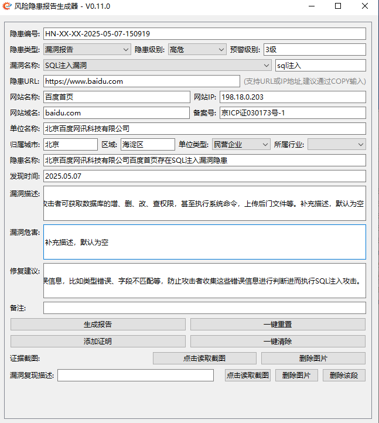

# 简介

基于[Coderrrr-400](https://github.com/Coderrrr-400/XhitReport) 师傅项目二开，也是`PyQt6+chatgpt`练手项目。

# 背景

在试用多款报告生成工具后终于放弃了，每个项目在安装或使用的过程中都存在一些瑕疵。


如果只关注报告而不关注格式，每个选项似乎都不错，各有千秋。遗憾的是，它们都无法完全匹配正在使用的模板。我曾考虑对其中一些项目进行二次开发，但对于我这个初学者来说，难度太大了。相比之下，`Coderrrr-400`师傅的项目对我来说比较简单直接，也更加可塑。虽然我不懂`PyQt`，但在`chatgpt`和`Google`的帮助下，二次开发的项目还是达到了预期效果。

# 配置

`config.yaml`

```
report_Template: 'templates/report_template.docx'
vulnerability_List: 'data/vulnerabilities.xlsx'
ICP_List: 'data/icp_info.xlsx'
supplierName: '张三'
city: '北京'
region: '海淀区'
```

`vulnerabilities.xlsx`

- 必须包含`漏洞名称`、`漏洞描述`、`修复建议`这三个表头，除此之外的表头都未做识别

  
  

`icp_info.xlsx`

- 必须包含`unitName(单位名称)`、`domain(根域名)`、`serviceLicence(备案号)`，除此之外的表头都未做识别

  

- 数据来源

  

  可以使用 [ICP_Query_Batch](https://github.com/s1g0day/ICP_Query_Batch) 进行自动提取

# 启动

该项目适用于 `python3.*` ，已验证:

- 开发：3.11.4
- 测试：3.8.6

1、安装模块

```
pip3 install -r requirements.txt -i https://mirrors.tuna.tsinghua.edu.cn/pypi/web/simple some-package
```

2、启动GUI

```
python3 ReportGenX.py
```

3、偷个懒使用start.bat

```
@echo off
rem 隐藏黑色窗口
if "%1"=="h" goto begin 
mshta vbscript:createobject("wscript.shell").run("%~nx0 h",0)(window.close)&&exit 
:begin 

REM 检查Python的安装路径
set PYTHON=python
set PYTHON3=python3

REM 优先使用Python3
if exist %PYTHON3% (
    set PYTHON=%PYTHON3%
)

REM 使用Python运行demo.py
%PYTHON% ReportGenX.py

REM 检查是否成功运行
if %ERRORLEVEL% neq 0 (
    echo Failed to run ReportGenX.py
    pause
    exit /b 1
)

echo Successfully ran ReportGenX.py
pause
exit /b 0

```

> 注: 如果使用start.bat的话，有两点需要注意:

- 我们的电脑可能会安装python2和python3两个版本，需要注意默认`PYTHON=python`调用的版本，如果`2版本`的话就无法启动
- 也要保证已经配置合适的环境变量

```
C:\Users\test>python2 -V
Python 2.7.18

C:\Users\test>python3 -V
Python 3.11.4

C:\Users\test>python -V
Python 3.11.4

C:\Users\test>path
PATH=D:\python\3;D:\python\2;D:\python\3\Scripts;D:\python\2\Scripts;
```

pyinstaller打包命令如下：

```
pip3 install Pillow pyinstaller -i https://mirrors.tuna.tsinghua.edu.cn/pypi/web/simple some-package
pyinstaller.exe -F -i resources\icon\favicon.ico -w ReportGenX.py
```

- --strip : 减小生成文件大小
- --exclude-module : 排除不需要的模块

## 基础测试

> 注: 图中所示为随便复制的测试数据，非实际漏洞



### 20250507-新增漏洞搜索功能

便于漏洞表格过多时，上下翻找漏洞比较麻烦的情况，输入关键词`回车`即可。


## 基础输出

### xxx.docx

`output/report/`


### output.txt

因为需求差异性，我这里我保留了最低数据。如有其他需求，可以自行修改`core/report_generator.py`文件

`output/report/2025.05.07_output.txt`

```
北京百度网讯科技有限公司	baidu.com	SQL注入漏洞	张三	高危	2025.05.07
```

## 漏洞复现多图文


报告内容


## 删除功能


```
一键重置: 重置所有数据
一键清除: 仅删除所有漏洞附件及描述
```

# 二开

本项目只适用于当前模板，如果有需要可以对其再次二开，相应功能都已在代码中做注释。

除常规功能外，引入了一些特殊的功能

- 1、根据输入自动改变输出
  - 根据隐患级别自动改变预警级别
  
  - 根据单位名称、网站名称自动改变隐患名称和问题描述默认值
  
  - 根据隐患类型自动改变隐患名称、问题描述及整改建议
  
- 2、根据隐患URL自动提取根域名

- 3、针对漏洞复现添加单个或多个图文

- 4、网站IP自动解析

---

20240819-更新说明

随着代码更新迭代不断，如今单文件已经达到近800行的规模。虽然不算太多，但是每次间隔一段时间后再来阅读，还是得花费不少时间去理解。在最新的更新中，我对项目进行了一些的调整和改进。通过模块化使得代码逻辑更加清晰，更加完善和易于阅读。这种改进不仅减少了二次开发和维护的难度，还提高了项目的可扩展性和稳定性。

在 9.x 版本发布之际，我也将ShitReport更名为ReportGenX。原本的名字只是习惯性使用python文件名当作项目名，所以直接借用了Coderrrr-400师傅的命名。而ReportGenX也是项目创建之时已经定下了，不过是另一个构想项目，但现在这个项目已基本达到我所追求的目标，因此就将名字拿过来用了。

初始的想法是希望使用者以这个项目为基础，根据自家的模板进行二次开发，以适应自己的项目需求。但由于模板的多样化，目前仍然无法做到只修改模板不动代码的目标。并且目前仍有一些问题尚未解决

- 漏洞复现部分无法通过关键词来定位，单图文好实现，但多图文的话就无法准确定位了。所以这部分代码仍然保持着”如果代码有效，就不要修复它“的理论状态

项目发布之初，已被师傅发布到公众号进行推荐，在此非常感谢各位师傅的信任和支持，但因为上面的原因我从未主动推荐过这个项目。现在正式将这个项目推荐给各位师傅，期望这个项目能给你带来惊喜和便利。

# 贡献与支持

如果本项目对你有用，还请star鼓励一下。

无论是添加新功能、改进代码、修复BUG或提供文档。请通过GitHub的Issue和Pull Request提交您的贡献，我会尽快给予帮助及更新。
