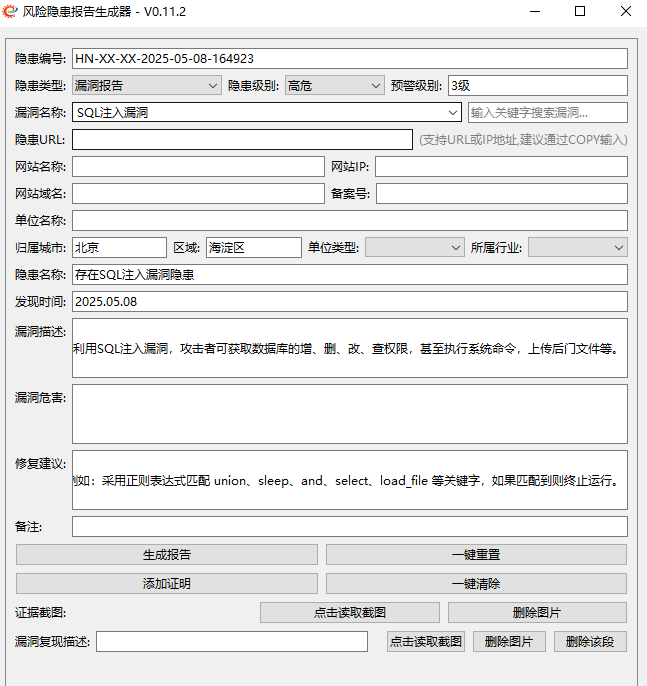

# 简介

ReportGenX 是一个专门用于生成安全评估报告的自动化工具。适用于渗透测试人员、安全评估工程师等进行安全评估报告的快速生成，可大幅提高工作效率。

基于[Coderrrr-400](https://github.com/Coderrrr-400/XhitReport) 师傅项目二开，也是`PyQt6+chatgpt`练手项目。

## 功能特点

它具有以下主要特点：

1. 自动化报告生成
   - 支持漏洞信息和ICP备案信息的批量导入
   - 自动根据模板生成规范化的Word文档报告
   - 支持漏洞复现的多图文描述

2. 智能数据处理
   - 根据域名自动解析网站IP、备案号等信息
   - 根据漏洞级别自动调整预警级别
   - 支持漏洞信息的自定义添加和数据库存储

3. 用户友好界面
   - 提供图形化操作界面
   - 支持漏洞信息快速搜索
   - 一键重置和清除功能

4. 灵活的二次开发
   - 模块化设计，便于功能扩展
   - 详细的代码注释，方便定制开发
   - 支持自定义报告模板

5. 本地化部署
   - 所有数据处理均在本地完成
   - 无需连接外部服务器
   - 数据安全性高

## 应用场景

本工具适用于以下场景：
1. 渗透测试人员生成安全评估报告
2. 安全评估工程师进行合规性检查
3. 安全服务提供商为客户提供标准化报告
4. 企业内部安全团队进行定期安全评估

## 运行模式

目前本项目仅支持客户端运行模式，待项目开发完善之后，会考虑服务端部署方式。

同类项目推荐:

- 以服务端部署居多，有需要可以尝试一下

| 项目地址                                                     | 运行模式      | 编程语言 | 收录时间 | 最后更新(截至20250616) |
| ------------------------------------------------------------ | ------------- | -------- | -------- | ---------------------- |
| [report-generator-next](https://github.com/shuaihaoV/report-generator-next) | 客户端-GUI    | Rust   | 20250616 | 20250616               |
| [PenTestReportGen](https://github.com/ifraise/PenTestReportGen) | 客户端-GUI    | Python   | 20250528 | 20250514               |
| [petereport-zh](https://github.com/feishi-1/petereport-zh)   | 服务端        | Python   | 20250125 | 20241010               |
| [petereport](https://github.com/1modm/petereport)            | 服务端        | Python   | 20250125 | 20240419               |
| [APTRS](https://github.com/APTRS/APTRS)                      | 服务端        | Python   | 20240116 | 20250518               |
| [BlackStone](https://github.com/micro-joan/BlackStone)       | 服务端        | PHP      | 20240116 | 20241022               |
| [Bug_writer](https://github.com/yichensec/Bug_writer)        | 客户端-命令行 | Python   | 20240116 | 已删库                 |
| [BugRepoter_0x727](https://github.com/0x727/BugRepoter_0x727) | 服务端        | PHP      | 20240116 | 20250208               |
| [ExportReport](https://github.com/Potato-py/ExportReport)    | 服务端        | PHP      | 20240116 | 20240329               |
| [report](https://github.com/CTF-MissFeng/report)             | 服务端        | Golang   | 20240116 | 20210630               |
| [Savior](https://github.com/Mustard404/Savior)               | 服务端        | Python   | 20240116 | 20220509               |
| [SecReport](https://github.com/SecAegis/SecReport)           | 服务端        | Python   | 20240116 | 20250502               |
| [sysreptor](https://github.com/Syslifters/sysreptor)         | 服务端        | Python   | 20240116 | 20250523               |
| [XhitReport](https://github.com/Coderrrr-400/XhitReport)     | 客户端-GUI    | Python   | 20240116 | 20231114               |

> 注：项目基于关键词检索，可能收录不全，欢迎补充

关键词

```
渗透测试报告 生成
漏洞报告 生成
漏洞 报告
```

# 使用教程

## 配置

`config.yaml`

```
template_path: 'resources/templates/report_template.docx'
vul_or_icp: 'data/combined.db'
supplierName: '张三'
city: '北京'
region: '海淀区'
```

`vulnerabilities.xlsx`

- 必须包含`漏洞名称`、`风险级别`、`漏洞描述`、`修复建议`这三个表头，除此之外的表头都未做识别

  可以使用[Vulnerability-description-and-fix](https://github.com/s1g0day/Vulnerability-description-and-fix)
  
  
  

`icp_info.xlsx`

- 必须包含`unitName(单位名称)`、`domain(根域名)`、`serviceLicence(备案号)`，除此之外的表头都未做识别

  

- 数据来源

  也可以使用 [ICP_Query_Batch](https://github.com/s1g0day/ICP_Query_Batch) 进行自动提取

  
  

## 启动

兼容环境

- windows
- mac(GUI布局存在异常，暂无设备用于调试)
- linux(kali运行无异常)

该项目适用于 `python3.*` ，已验证:

- 开发：3.11.4
- 测试：3.8.6

1、安装模块

```
pip3 install -r requirements.txt -i https://mirrors.tuna.tsinghua.edu.cn/pypi/web/simple some-package
```

2、启动GUI

```
python3 ReportGenX.py
```

3、偷个懒使用start.bat

```
@echo off
rem 隐藏黑色窗口
if "%1"=="h" goto begin 
mshta vbscript:createobject("wscript.shell").run("%~nx0 h",0)(window.close)&&exit 
:begin 

REM 检查Python的安装路径
set PYTHON=python
set PYTHON3=python3

REM 优先使用Python3
if exist %PYTHON3% (
    set PYTHON=%PYTHON3%
)

REM 使用Python运行demo.py
%PYTHON% ReportGenX.py

REM 检查是否成功运行
if %ERRORLEVEL% neq 0 (
    echo Failed to run ReportGenX.py
    pause
    exit /b 1
)

echo Successfully ran ReportGenX.py
pause
exit /b 0

```

> 注: 如果使用start.bat的话，有两点需要注意:

- 我们的电脑可能会安装python2和python3两个版本，需要注意默认`PYTHON=python`调用的版本，如果`2版本`的话就无法启动
- 也要保证已经配置合适的环境变量

```
C:\Users\test>python2 -V
Python 2.7.18

C:\Users\test>python3 -V
Python 3.11.4

C:\Users\test>python -V
Python 3.11.4

C:\Users\test>path
PATH=D:\python\3;D:\python\2;D:\python\3\Scripts;D:\python\2\Scripts;
```

pyinstaller打包命令如下：

```
pip3 install Pillow pyinstaller -i https://mirrors.tuna.tsinghua.edu.cn/pypi/web/simple some-package
pyinstaller.exe -F -i resources\icon\favicon.ico -w ReportGenX.py
```

- --strip : 减小生成文件大小
- --exclude-module : 排除不需要的模块

## 基础测试

> 注: 图中所示为随便复制的测试数据，非实际漏洞



## 基础输出

### xxx.docx

`output/report/`


合并多个漏洞文件到单文件

```
# 默认输入输出目录为 output\report
python3 merge_docx.py

# 指定输入目录, 输出默认仍为output\report
python3 merge_docx.py -d "指定的目录路径"

# 指定输入输出
python merge_docx.py -d "指定的目录路径" -o "指定的输出文件路径"
```

### output.txt

因为需求差异性，我这里我保留了最低数据。如有其他需求，可以自行修改`core/report_generator.py`文件

`output/report/2025.05.07_output.txt`

```
漏洞报告	北京百度网讯科技有限公司	baidu.com	SQL注入漏洞	张三	高危	2025.05.07
```

## 漏洞复现多图文


报告内容


## 删除功能


```
一键重置: 重置所有数据
一键清除: 仅删除所有漏洞附件及描述
```

## 二开

本项目只适用于当前模板，如果有需要可以对其再次二开，相应功能都已在代码中做注释。

除常规功能外，引入了一些特殊的功能

- 1、根据输入自动改变输出
  - 根据隐患级别自动改变预警级别
  
  - 根据域名自动解析与变更网站IP、备案号、单位名称、单位类型
  
  - 根据单位名称、网站名称自动改变隐患名称和问题描述默认值
  
  - 根据隐患类型自动改变隐患名称、问题描述及整改建议
  
  - 根据自定义漏洞，自动保存漏洞信息到数据库文件
- 2、根据隐患URL自动提取根域名
- 3、针对漏洞复现添加单个或多个图文


# 贡献与支持

如果本项目对你有用，还请star鼓励一下。

无论是添加新功能、改进代码、修复BUG或提供文档。请通过GitHub的Issue和Pull Request提交您的贡献，我会尽快给予帮助及更新。
