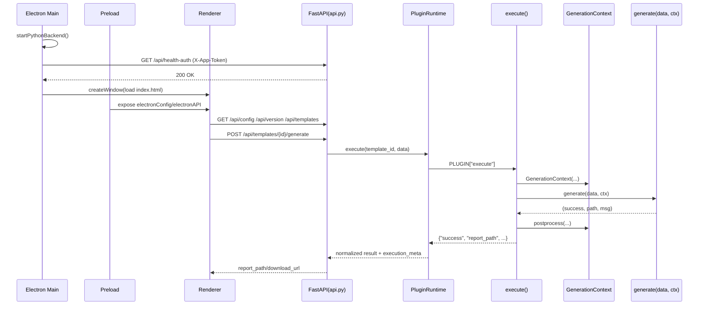

# ReportGenX 架构分层与逻辑流程分析

> 适用范围：`ReportGenX`（Electron + FastAPI）
> 更新时间：2026-05-30
> 当前版本：0.20.1

---

## 1. 系统总览

ReportGenX 采用"桌面壳 + 本地服务 + 模板插件"的分层结构：

- **桌面宿主**：Electron（主进程 + preload + 渲染层）
- **本地业务服务**：FastAPI（`backend/api.py`）
- **核心实现层**：`backend/core/*`
- **SDK 门面层**：`core/`（从 `backend.core.*` 重导出）
- **模板执行层**：`backend/plugin_host/runtime.py` + `backend/templates/*`

核心主链路：

1. `main.js` 启动后端并等待 `GET /api/health-auth` 成功；
2. `preload.js` 将 `apiBaseUrl` 与 `appApiToken` 注入渲染层；
3. 前端通过 `src/js/api.js` 访问后端；
4. 报告生成请求进入 `PluginRuntime.execute()`；
5. 模板 `execute()` 函数通过 `GenerationContext` 生成文档；
6. 后端返回 `report_path/download_url`。

---

## 2. 分层架构（职责边界）

### 2.1 L0 - 宿主与进程编排层（Electron Main）

**主要文件**：`main.js`

职责：

- 单实例锁（防重复启动）
- 启动/结束 Python 后端进程
- 启动阶段令牌握手（`/api/health-auth`）
- 外链 allowlist（协议 + host）
- 应用退出时清理后端进程树

关键实现：

- 每次启动生成 `APP_API_TOKEN`
- 后端进程环境变量注入 `APP_API_TOKEN`
- 握手失败（403 token mismatch）时直接弹窗退出

### 2.2 L1 - 安全桥接层（Preload）

**主要文件**：`preload.js`

职责：

- 解析主进程注入的 `additionalArguments`
- 暴露 `window.electronAPI.openExternal`
- 暴露 `window.electronConfig`（`apiBaseUrl`、`appApiToken`、`appVersion`）

说明：

- 运行于 `contextIsolation: true` + `sandbox: true`，渲染层不能直接拿 Node 能力。

### 2.3 L2 - 渲染编排与交互层（Renderer）

**主要文件**：

- `src/js/main.js`
- `src/js/api.js`
- `src/js/config.js`
- `src/js/utils.js`
- `src/js/form-renderer.js`
- `src/js/form-renderer-fields.js`
- `src/js/form-renderer-images.js`
- `src/js/toolbox.js`
- `src/js/template-manager.js`
- `src/js/vuln-manager.js`
- `src/js/crud-manager.js`

职责：

- 页面初始化、版本一致性检查、模板加载
- 动态表单渲染（14 种字段类型）与报告提交
- Template widget 系统（`GET /api/templates/{id}/widgets/{file}`）
- 工具箱功能（合并、模板管理、系统设置、ICP、漏洞库）
- 统一 API 调用与错误处理

### 2.4 L3 - API 网关与应用服务层（FastAPI）

**主要文件**：`backend/api.py`

职责：

- REST API（配置、模板、报告、漏洞、ICP）
- 统一错误响应
- `app_token_middleware` 令牌校验
- 路径白名单（open-folder）
- 模板管理器生命周期与插件路由挂载（`/api/plugin/{template_id}/...`）

### 2.5 L4 - 核心实现层（Domain Core）

**主要目录**：`backend/core/*`

职责：

- `template_manager.py` — 模板扫描/校验/依赖检查（含 `ast.parse()` 安全审计）
- `handler_registry.py` — 旧版 Handler 注册（兼容回退用）
- `generation_context.py` — 统一服务注入层（当前标准）
- `schema_loader.py` — YAML → Pydantic 解析
- `schema_models.py` — Pydantic 数据模型（FieldDefinition, TemplateInfo 等）
- `base_handler.py` — 旧版基类（已不再使用，保留兼容）
- `data_reader_db.py` — SQLite 数据库读取
- `document_editor.py` — Word 文档文本/表格编辑
- `document_image_processor.py` — Word 图片插入/清理
- `handler_utils.py` — TableProcessor 等工具
- `report_merger.py` — 报告合并（docxcompose）
- `summary_generator.py` — 文本摘要生成
- `logger.py` — 日志系统
- `exceptions.py` — 自定义异常

约束：

- 后端运行时代码以 `backend.core.*` 为准；
- `core/*` 为模板/插件兼容 SDK 门面层。

### 2.5a - SDK 门面层

**主要文件**：`core/__init__.py`

从 `backend.core.*` 重导出稳定 API 供模板使用：

```python
from core import (
    gen_report_id,           # 生成报告 ID
    set_default_dates,       # 填充日期默认值
    set_supplier_defaults,   # 填充供应商默认值
    GenerationContext,       # 生成上下文
    SummaryGenerator,        # 摘要生成器
    SummaryTemplates,        # 摘要模板
)
```

### 2.6 L5 - 插件执行层（Plugin Runtime + Templates）

**主要文件**：

- `backend/plugin_host/runtime.py`
- `backend/templates/<template_id>/{schema.yaml, handler.py, template.docx, runtime.yaml}`

职责：

- 按 `plugin_runtime.mode`（`descriptor/hybrid/legacy/isolated`）执行
- PLUGIN descriptor 解析与调用
- 支持 isolated 灰度（全局比例 + 模板级覆盖）
- 统一输出 `execution_meta`（mode、耗时、worker 信息）

### 2.6a - Widget 子系统

模板可在 `widgets/` 下放置自定义 JS/CSS：

```
backend/templates/{id}/widgets/vuln_list.js
backend/templates/{id}/widgets/style.css
```

- Widget 通过 `window.__widgetFactories` 注册工厂函数
- 前端通过 `AppFormRenderer.loadTemplateWidget(field)` 加载
- Widget 文件由 `GET /api/templates/{id}/widgets/{filename}` 提供服务
- Widget 接收 callbacks：`getData()`, `setData()`, `getFormValue()`, `setFormValue()`, `uploadImage()`, `apiRequest()`, `dataSources`, `getConfig()`, `toast()`, `openImagePreview()`

---

## 3. 端到端主流程（启动到生成报告）

1. Electron `app.whenReady()` 后启动后端；
2. 主进程轮询 `GET /api/health-auth`（携带 `X-App-Token`）直到成功；
3. 创建窗口并加载 `src/index.html`；
4. 渲染层初始化模块，调用 `/api/config`、`/api/version`、`/api/templates`；
5. 用户提交生成请求 `POST /api/templates/{id}/generate`；
6. 后端通过 `PluginRuntime.execute()` → 解析 PLUGIN descriptor → 调用 `execute()`;
7. `execute()` 创建 `GenerationContext` → `preprocess()` → `generate(data, ctx)` → `ctx.postprocess()`;
8. 产出报告并返回下载信息。



---

## 4. 安全与运行时边界（当前实现）

### 4.1 Token 保护规则

- `/api/*` 的 `POST/PUT/PATCH/DELETE` 默认要求 `X-App-Token`
- 受保护 GET：
  - `/api/backup-db`
  - `/api/health-auth`
  - `/api/templates/{template_id}/export`
- `GET /api/health` 为非鉴权存活探针

说明：

- `src/js/api.js` 默认走 Header；
- 下载场景（`window.open`）使用 `?app_token=` 兼容。

### 4.2 启动握手与错连防护

- 主进程启动后端后必须通过 `health-auth` 握手才开窗；
- 若返回 403，视为"端口上已有旧后端实例（令牌不匹配）"，直接中断启动。

### 4.3 路径安全

- 报告输出路径在 core 层做规范化与 containment 校验；
- `open-folder` 仅允许配置白名单路径。

### 4.4 PluginRuntime 配置入口

- `GET /api/plugin-runtime-config`：读取 runtime 配置
- `POST /api/plugin-runtime-config`：更新 runtime 配置（受 `X-App-Token` 保护）

注意：

- 当前 **没有** 管理员会话口令门禁（无 `admin-session` / `X-Admin-Session`）。

---

## 5. Plugin Runtime 执行模式

`backend/shared-config.json` 中的 `plugin_runtime` 块控制执行策略：

| 模式 | 说明 |
|------|------|
| `descriptor` | 仅使用 PLUGIN descriptor 执行。无有效 PLUGIN 则失败。 |
| `hybrid` | **(默认)** 先尝试 descriptor，失败时回退到旧版 HandlerRegistry。 |
| `legacy` | 仅使用旧版类继承 Handler。 |
| `isolated` | 在独立子进程中执行（multiprocessing）。支持灰度放量。 |

更多配置细节见 [RUNTIME_OPERATIONS_RUNBOOK.md](./RUNTIME_OPERATIONS_RUNBOOK.md)。

---

## 6. 自动化验证状态

- Electron 冒烟：`npm run test:e2e:smoke`
- CI：`.github/workflows/ci-smoke.yml` 执行后端测试 + Electron 冒烟
- 后端单元测试：`npm run test`（已移除，当前为空操作）

---

## 7. 风险与观察（按优先级）

| 风险ID | 标题 | 优先级 | 当前状态 | 说明 |
|---|---|---|---|---|
| R1 | 插件执行隔离仍处于策略灰度阶段 | P1 | 进行中 | `isolated` 已可用，仍需按模板逐步放量 |
| R2 | 错误契约存在少量历史接口风格差异 | P1 | 进行中 | 主体已统一，边缘接口仍可继续收敛 |
| R3 | shared-config 规范化逻辑多端维护 | P2 | 观察中 | `main/preload/backend` 均有 normalize |
| R4 | 跨模板报告合并存在格式漂移缺陷 | P3 | 设计阶段 | 见 [DOCX_MERGE_REPAIR_DESIGN.md](./DOCX_MERGE_REPAIR_DESIGN.md) |

---

## 8. 结论

当前架构已从"可运行"升级到"可控可验证"：

- 启动链路加入 token 握手，显著降低旧进程错连风险；
- 模板系统完成 PLUGIN descriptor + GenerationContext 架构演进；
- runtime 已支持 `isolated` 灰度与回退；
- 工具箱核心链路已有本地 smoke 与 CI 冒烟兜底。

下一阶段建议聚焦于：**isolated 放量、错误契约彻底统一、配置解析单点收敛、跨模板合并改进**。
