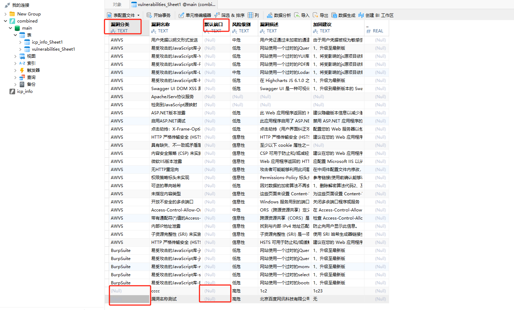
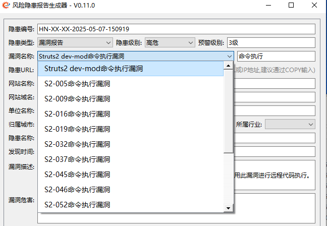

# 版本更新

- v0.12.1 版本更新-20250705

```
1、添加报告合并功能
```

- v0.12.0 版本更新-20250616

```
1、添加自动打开工信部备案网站功能
```

- v0.11.5 版本更新-20250613

```
1、添加报告文件合并脚本，直接生成多漏洞的程序暂时无法实现。
```

- v0.11.4 版本更新-20250611

```
1、导出所有输入的信息到db,暂时忽略图片
2、如果是漏洞库中不存在的漏洞，在生成报告时，选择是否将漏洞更新，默认更新
3、生成报告时自动变更漏洞编号
```

- v0.11.3 版本更新-20250509


```
1、修复一些bug
```

- v0.11.2 版本更新-20250508

```
1、将excel数据转为sqlite数据并合并为一个db文件
2、优化图片处理，使其可以直接复制网络图片和本地图片
3、添加根据ICP自动识别单位类型
4、优化域名处理，子域名和根域名备案不同时优先选择子域名备案(一般多为政府单位会出现这种情况)
```

- v0.11.1 版本更新-20250508

```
1、修改漏洞名称为可自定义模式, 在自定义模式下生成报告时会自动更新漏洞信息到相应文件
```

若漏洞不在数据库中，则需要关闭程序，并在xlsx中添加漏洞信息。操作起来比较麻烦，在`0.11.2`版本解决了这一问题

- 1、当自定义漏洞名称时，需要书写相应的`漏洞描述`和`修复建议`。

  说明: `漏洞危害`是追加到`漏洞描述`中的，所以可以统一写在`漏洞描述`中。

- 2、如果是自定义漏洞，在生成报告的时候会将填写的`漏洞名称、隐患级别、漏洞描述、修复建议`自动更新到数据库文件`漏洞名称、风险、漏洞描述、加固建议`，以便以后再用。

  说明：在自动更新的数据中不会添加漏洞分类和默认端口，以便表格多样化。缺失的数据，需要手动补充。




在`0.11.2`版本中，ICP和漏洞文件已更换为`sqlite`, 若感觉直接操作db文件觉的麻烦，在data目录中也提供了`Excel与SQLite数据库`间相互转换工具`data\Excel_SQLite\xlsx_to_sqlite.py`, 使用教程可以阅读`data\Excel_SQLite\readme.md`。

```
python3 xlsx_to_sqlite.py --output combined.db
```

`combined.db`：一般为固定，如果修改，则需同步修改`config.yaml`文件


- v0.11.0 版本更新-20250507

```
1、为漏洞类型添加搜索功能
2、优化多处代码
```

便于漏洞数据过多时，上下翻找漏洞比较麻烦的情况，输入关键词`回车`即可。



- v0.10.0 版本更新-20250205

```
1、添加隐患类型和归属区域
2、添加自动解析URL的IP
```

- v0.9.4 版本更新-20241010

```
1、修改报告及日志导出代码
2、打包exe
```

- v0.9.1 版本更新-20240805

```
1、重组项目结构
```


随着代码更新迭代不断，如今单文件已经达到近800行的规模。虽然不算太多，但是每次间隔一段时间后再来阅读，还是得花费不少时间去理解。在最新的更新中，我对项目进行了一些的调整和改进。通过模块化使得代码逻辑更加清晰，更加完善和易于阅读。这种改进不仅减少了二次开发和维护的难度，还提高了项目的可扩展性和稳定性。

在 9.x 版本发布之际，我也将ShitReport更名为ReportGenX。原本的名字只是习惯性使用python文件名当作项目名，所以直接借用了Coderrrr-400师傅的命名。而ReportGenX也是项目创建之时已经定下了，不过是另一个构想项目，但现在这个项目已基本达到我所追求的目标，因此就将名字拿过来用了。

初始的想法是希望使用者以这个项目为基础，根据自家的模板进行二次开发，以适应自己的项目需求。但由于模板的多样化，目前仍然无法做到只修改模板不动代码的目标。并且目前仍有一些问题尚未解决

- 漏洞复现部分无法通过关键词来定位，单图文好实现，但多图文的话就无法准确定位了。所以这部分代码仍然保持着”如果代码有效，就不要修复它“的理论状态

项目发布之初，已被师傅发布到公众号进行推荐，在此非常感谢各位师傅的信任和支持，但因为上面的原因我从未主动推荐过这个项目。现在正式将这个项目推荐给各位师傅，期望这个项目能给你带来惊喜和便利。

- v0.8.4 版本更新-20240717

```
1、修复bug，去除输入的数据首尾空格及换行符
```

- v0.8.3 版本更新-20240710

```
1、添加漏洞危害，用来补充漏洞描述
```

- v0.8.2 版本更新-20240708

```
1、更改目录结构
```

- v0.8.1 版本更新-20240705

```
1、添加根据域名自动识别ICP备案
```

- v0.7.1 版本更新-20240605

```
1、添加一键清除功能
```

- v0.7 版本更新-20240604

```
1、从excel内获取漏洞信息
```

- v0.6.2  版本更新-20240604

```
1、修改报告模板
```

- v0.6.1 版本更新-20240601

```
1、改变导出的word文件名格式
```

- v0.6 版本更新-20240531

```
1、PyQt5升级到PyQt6
```

- v0.5.2 版本更新-20240531

```
1、为窗口添加滚动区域
2、修复GUI缩放与word原图问题
3、修复漏洞描述与图片不分行问题
```

- v0.5.1 版本更新-20240530

```
1、添加多个漏洞描述及图片的按钮及功能，原则上不限量，但建议不超过10个，否则生成的时候就会比较卡
```

- v0.4 修复bug-20240529

```
1、修改插入的图片大小为表格自适应
2、修改插入图片时文字描述和图片同时居中的问题
3、修改不输入漏洞描述时存在空行的问题
4、报告生成到相应公司目录下
```

- v0.3 初版完成-20240528

```
1、完成表格导出并保留原格式
2、修改隐患名称可自动根据单位名称、网站名称及隐患类型生成，并同步到问题描述中
3、自动提取URL中根域名
4、自动根据隐患类型生成整改建议
5、配置文件修改自定义隐患类型及修复建议
6、添加一键插入漏洞复现图文(未完成已注释)
```

- v0.2 功能设计-20240527

```
1、自动生成编号
2、配置文件添加自定义隐患类型
3、配置文件添加自定义默认城市
4、配置文件添加单位类型及所属行业
5、完成其他文本框变量定义
```

- v0.1 开工-20240524

```
初步完成基本功能，可以实现:
1、完成GUI设计
```
